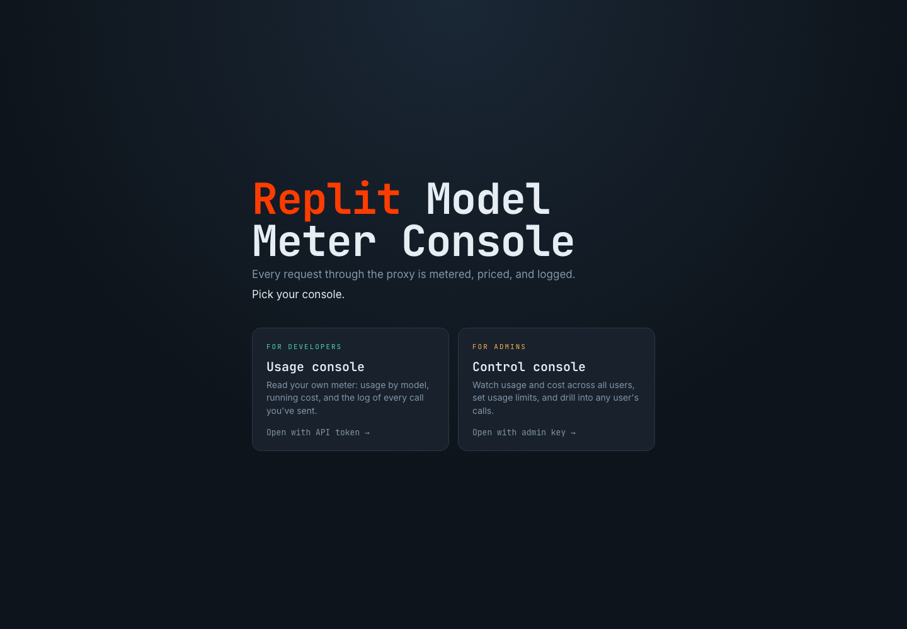
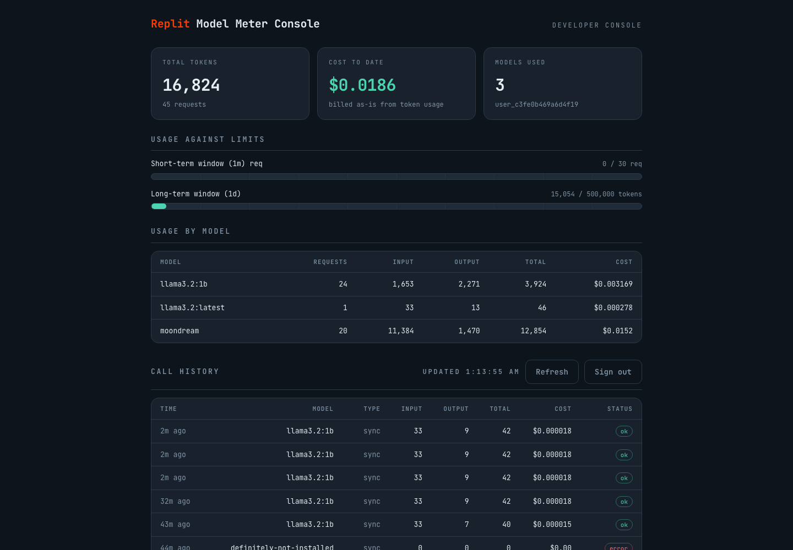
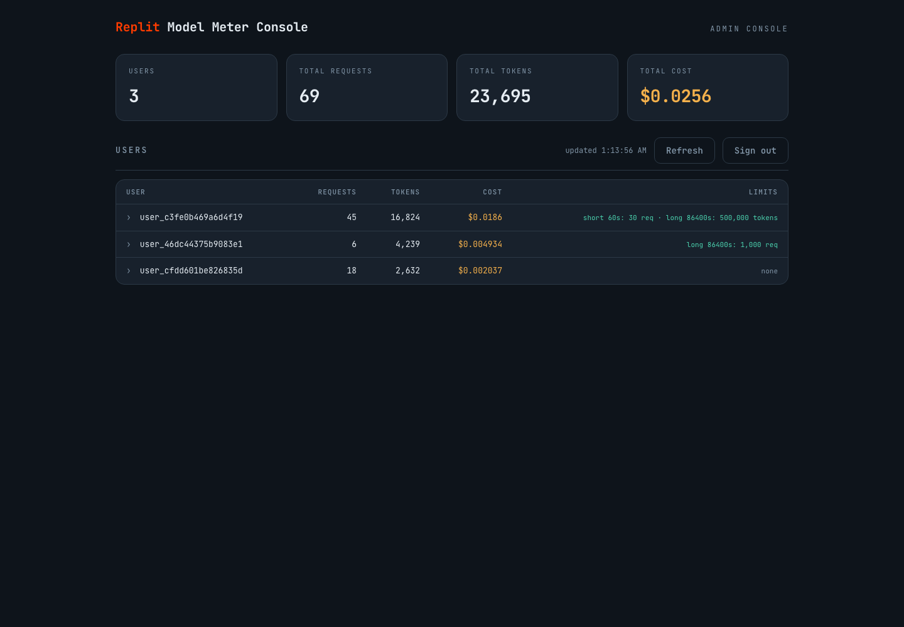

# replit-proxy-server

An OpenAI-compatible LLM proxy in TypeScript.
It sits in front of either a local [Ollama](https://ollama.com) server or [Ollama Cloud](https://docs.ollama.com/cloud), authenticates users by API token, meters token usage per user per model, prices that usage, and enforces admin-configured usage limits.

## Demo

### Replit app

Check it out at https://replit-proxy-server--CeliaZhen.replit.app. Use `demo-alice` as an example bearer token to view Developer console, and `admin-secret` for Admin console. 

You can send a request like below to see the real-time usage:

```
$ curl -sS https://replit-proxy-server--CeliaZhen.replit.app/v1/chat/completions \
  -H "Authorization: Bearer demo-alice" \
  -H "Content-Type: application/json" \
  -d '{
    "model": "gpt-oss:20b",
    "messages": [
      {
        "role": "user",
        "content": "Explain why the sky is blue in two sentences."
      }
    ],
    "max_tokens": 150,
    "stream": false
  }'
```

### Local

The fastest way to see everything working, with data already populated in both dashboards:

```bash
# 1. Prerequisites: Node 22.19+ and Ollama installed

# 2. Install, seed demo data, and start the server
npm install
npm run seed         # writes demo users + usage/cost/history into data/meter.db
npm run start:local  # starts local Ollama, pulls demo models, then starts the proxy
```

Then open the dashboards in a browser:

| URL | Console | Sign in with |
|---|---|---|
| `http://localhost:8000/` | Landing - pick a console | - |
| `http://localhost:8000/dashboard` | Developer: usage, cost, call history | a demo API token (below) |
| `http://localhost:8000/admin/dashboard` | Admin: all users, cost, limits, per-user drill-down | the admin key `admin-secret` |

Demo API tokens created by the seed (any of them works on the developer dashboard):

| Token | Profile |
|---|---|
| `demo-alice` | Heavy user, both models, tight rate limits, a rejected call in history |
| `demo-bob` | Moderate user, no limits |
| `demo-carol` | Light user, vision (moondream) only |

Notes:
- `npm run seed` is idempotent and re-runnable; it prints the tokens, admin key, and URLs when it finishes.
- Any non-empty string works as an API token (identity is derived from it), so you can also send your own traffic - see the OpenAI-SDK example under [Quick start](#quick-start) - and it will appear in the consoles.
- The admin key defaults to `admin-secret`; override with `ADMIN_API_KEY=... npm start`.

### Dashboard previews

**Console picker**



**Developer usage console**



**Admin control console**



## Quick start

```bash
# Prerequisites: Node 22.19+ and Ollama installed

npm install
npm run start:local  # local Ollama + proxy on http://localhost:8000
```

`npm run start:local` starts Ollama when necessary, ensures `llama3.2:1b` and `moondream` are present, clears any inherited cloud credentials, and starts the proxy.

### Ollama Cloud

Ollama Cloud can be used directly without installing Ollama or keeping a model server running locally.
Create an [Ollama API key](https://ollama.com/settings/keys), then configure the model-server origin and key:

```bash
export OLLAMA_BASE_URL=https://ollama.com
export OLLAMA_API_KEY=your-ollama-cloud-key
npm start
```

`OLLAMA_BASE_URL` is the origin only, without `/v1`, because the proxy appends OpenAI-compatible paths such as `/v1/chat/completions`.
The API key is sent only to the configured model server as `Authorization: Bearer <OLLAMA_API_KEY>`.
Client tokens are used only to authenticate with this proxy and are never forwarded to Ollama Cloud.
Use `GET /v1/models` through the proxy to see the cloud models available to the configured Ollama account.

Use it exactly like the OpenAI API:
The example below uses the local demo model; when using Ollama Cloud, replace it with a model returned by `GET /v1/models`.

```python
from openai import OpenAI

client = OpenAI(base_url="http://localhost:8000/v1", api_key="my-user-token")

response = client.chat.completions.create(
    model="llama3.2:1b",
    messages=[
        {"role": "system", "content": "You are a helpful assistant."},
        {"role": "user", "content": "What is 2+2?"},
    ],
    temperature=0.7,
    max_tokens=100,
)
```

Both `base_url="http://localhost:8000"` and `.../v1` work (routes are registered under both prefixes, since SDKs differ in what they append).

### Dashboards

With the server running, open in a browser:

| URL | Console | Sign in with |
|---|---|---|
| `http://localhost:8000/` | Landing - pick a console | - |
| `http://localhost:8000/dashboard` | Developer: your usage, cost, and call history | your API token |
| `http://localhost:8000/admin/dashboard` | Admin: all users, cost, limit administration, per-user call drill-down | the admin key |

The pages hold no secrets - they prompt for the token/key in the browser and call the same JSON APIs, so they are served without server-side auth while every API call they make is still authorized. Send a few requests through the proxy first so there is data to show.

### Verifying

```bash
npm test             # 71 unit/integration tests (no Ollama needed)
npm run typecheck    # strict TypeScript
npm run test:e2e     # end-to-end via the `openai` SDK against live Ollama:
                     #   chat, streaming, moondream vision, usage API, 429 enforcement

# Load test (measures the proxy itself, using an instant mock model server):
npx tsx scripts/mock-ollama.ts &
OLLAMA_BASE_URL=http://127.0.0.1:11435 LOG_LEVEL=warn npm start &
npm run loadtest
```

Measured on a MacBook (single Node process, 200 concurrent connections, 50 distinct users, 15s):

```
Requests/sec  avg=10,875   max=11,237
Latency (ms)  avg=17.9  p50=17  p97.5=23  p99=24
2xx=163,134  errors=0  timeouts=0
```

Post-run accounting was exact: recorded tokens equaled `requests * tokens-per-response` with zero drift, confirming usage metering is loss-free under concurrency.

## API surface

### User endpoints (authenticated by `Authorization: Bearer <user-token>`)

| Route | Description |
|---|---|
| `POST /v1/chat/completions` | Proxied to Ollama; streaming and vision supported |
| `POST /v1/completions` | Legacy completions, proxied |
| `GET /v1/models` | Passthrough |
| `GET /v1/usage` | The caller's per-model token usage, cost, cumulative totals, and current limits |
| `GET /v1/history` | The caller's recent call history (newest first), each with tokens, cost, and outcome |
| `GET /healthz` | Unauthenticated health check |

`GET /v1/usage` example response (each model now carries its computed `cost_usd`):

```json
{
  "user_id": "user_1c9f2a...",
  "models": {
    "llama3.2:1b": { "input_tokens": 70, "output_tokens": 29, "total_tokens": 99, "requests": 2, "cost_usd": 0.00005025 },
    "moondream":   { "input_tokens": 744, "output_tokens": 85, "total_tokens": 829, "requests": 1, "cost_usd": 0.0009405 }
  },
  "totals": { "input_tokens": 814, "output_tokens": 114, "total_tokens": 928, "requests": 3, "cost_usd": 0.00099075 },
  "limits": null
}
```

### Admin endpoints (authenticated by `Authorization: Bearer $ADMIN_API_KEY`, default `admin-secret`)

| Route | Description |
|---|---|
| `GET /admin/usage` | Per-user usage + cost + limits for every user, plus a fleet-wide rollup |
| `GET /admin/history/:userId` | One user's recent call history (admin drill-down) |
| `GET /admin/pricing` | The active price sheet (USD per 1M input/output tokens) |
| `GET /admin/limits` | All configured limits |
| `GET /admin/limits/:userId` | One user's limits |
| `PUT /admin/limits/:userId` | Create/replace limits (validated) |
| `DELETE /admin/limits/:userId` | Remove limits (back to unlimited) |

Limit config shape - both windows optional, but at least one required (each window needs `maxRequests` and/or `maxTokens`):

```json
{
  "shortTerm": { "windowSeconds": 60,    "maxRequests": 100, "maxTokens": 50000 },
  "longTerm":  { "windowSeconds": 86400, "maxTokens": 2000000 }
}
```

Limits are windowed only. There is deliberately no lifetime/total cap: a permanent cap would exhaust a user's access to the platform, whereas windowed limits always recover as the window slides.

When a limit trips, the proxy returns **429** with an OpenAI-shaped error body and a `Retry-After` header, so `openai` SDK clients raise their native `RateLimitError` (verified in the e2e suite).

### Configuration (environment variables)

| Var | Default | Purpose |
|---|---|---|
| `PORT` | `8000` | Listen port |
| `OLLAMA_BASE_URL` | `http://127.0.0.1:11434` | Ollama model-server origin; use `https://ollama.com` for Ollama Cloud |
| `OLLAMA_API_KEY` | unset | Optional bearer token for an HTTPS model server; required for `ollama.com` |
| `ADMIN_API_KEY` | `admin-secret` | Admin API bearer token |
| `SERVER_CONNECTIONS` | `128` | Keep-alive socket pool size to the model server |
| `LOG_LEVEL` | `info` | Pino log level |
| `STORAGE` | `sqlite` | Storage backend: `sqlite` (durable, file-backed) or `memory` (ephemeral) |
| `DB_PATH` | `data/meter.db` | SQLite file path when `STORAGE=sqlite` |

## How cost is calculated

Cost is a pure function of the tokens the model server reports and a per-model price sheet - no estimation, no tokenizer in the proxy.
For one call:

```
cost_usd = (input_tokens  * input_per_million
          + output_tokens * output_per_million) / 1_000_000
```

The inputs:

- **Token counts** come from the model server's own `usage` object, never from a proxy-side guess.
Non-streaming responses carry `usage` in the JSON body; streaming responses carry it in the terminal SSE chunk (which is why the proxy injects `stream_options.include_usage`).
So billed tokens are exactly what Ollama reported.
- **Input and output are priced separately.** Real providers charge output tokens more than input, because output is generated one token at a time (the memory-bandwidth-bound decode phase) while input is processed in a single parallel forward pass (the compute-bound prefill phase). The sheet mirrors that split.
- **Only successful calls bill.** Rejected (429) and errored calls record `cost_usd: 0` - you pay for tokens actually generated, nothing else.

The cost math lives in one place (`Pricing.cost()` in `src/billing/pricing.ts`, surfaced through `src/billing/usage-view.ts`), so the user dashboard and admin overview can never disagree.

### The price sheet

| Model | Input ($/1M) | Output ($/1M) |
|---|---|---|
| `llama3.2:1b` | 0.20 | 1.25 |
| `moondream` | 0.75 | 4.50 |

see it live at `GET /admin/pricing`.

Note that a model with no explicit entry falls back to the default (the `gpt-5.4` rate) rather than costing $0, so cost is never silently zero.

## Architecture

```
                          ┌────────────────────────────────────────────────┐
 OpenAI SDK clients ────► │  Fastify (port 8000)                           │
                          │                                                │
                          │  auth hook ─► Limiter.check ─► ProxyHandler ───┼──► undici Pool ──► Ollama
                          │                   │                 │          │    (keep-alive
                          │             LimitStore        SseUsageScanner  │     sockets)
                          │                   │                 │          │
 Admin (separate key) ──► │  /admin/*     UsageStore ◄─────record          │
 Users ─────────────────► │  /v1/usage        │                            │
                          └───────────────────┴────────────────────────────┘
```

The Ollama model server in this diagram can be local or Ollama Cloud.
When `OLLAMA_API_KEY` is configured, the model-server module adds it only to the outbound Ollama request.

```
src/
  config.ts                 env-driven config, parsed once at startup
  auth.ts                   bearer-token -> userId mapping
  errors.ts                 OpenAI-shaped error envelope
  types.ts                  shared domain types (Usage, LimitConfig, ...)
  app.ts                    composition root - wires everything, testable via inject()
  server.ts                 entry point + graceful shutdown
  proxy/
    model-server.ts         authenticated undici connection pool to local Ollama or Ollama Cloud
    proxy-handler.ts        request lifecycle: limit-check -> forward -> observe -> record
    usage-extractor.ts      usage from JSON bodies and (incrementally) from SSE streams
  billing/
    pricing.ts              per-model price sheet; usage -> USD
    usage-view.ts           shared usage+cost view builder (user API and admin overview)
  limits/limiter.ts         limit evaluation + admin config validation
  routes/
    usage-routes.ts         GET /v1/usage, /v1/history
    admin-routes.ts         admin usage/history/pricing + limit CRUD
    call-serializer.ts      CallRecord -> API JSON
    ui-routes.ts            serves the three dashboard pages
  store/
    storage.ts              picks the backend (memory | sqlite) behind one Storage type
    usage-store.ts          UsageStore interface + in-memory lifetime-aggregate impl
    limit-store.ts          LimitStore interface + in-memory impl
    window-counter-store.ts WindowCounterStore - staggered fixed-window counters
    call-history-store.ts   CallHistoryStore - bounded per-user ring buffer of calls
    sqlite/
      database.ts           node:sqlite connection, pragmas (WAL), schema migration
      sqlite-usage-store.ts       durable UsageStore (UPSERT aggregates)
      sqlite-limit-store.ts       durable LimitStore (config as JSON)
      sqlite-window-counter-store.ts durable WindowCounterStore
      sqlite-call-history-store.ts   durable CallHistoryStore (insert + prune tx)
public/
  index.html                landing - pick a console
  user.html                 developer dashboard (usage, cost, gauges, call history)
  admin.html                admin dashboard (all users, limit editor, drill-down)
scripts/
  e2e.ts                    end-to-end suite using the `openai` SDK
  loadtest.ts               autocannon load test (multi-user traffic)
  mock-ollama.ts            instant model server for isolating proxy throughput
test/                       unit + integration tests (vitest, fake model server)
```

**Request lifecycle** for a completion:

1. Auth hook extracts the bearer token; the user's identity is the SHA-256 of the token (raw keys never appear in logs or admin output).
2. `Limiter.check` evaluates the short-term then long-term windowed limits against recorded usage.
Violations return 429 **before any model server work is done** - throttled users cost nothing.
3. The body is forwarded to Ollama over a keep-alive connection pool.
For streaming requests the proxy injects `stream_options.include_usage: true` so the terminal SSE chunk always carries token counts.
4. The response is piped back verbatim.
A scanner *observes* the bytes in flight to extract usage - it never buffers or modifies the stream - and records usage when the response completes.

## Design decisions and trade-offs

### Language & framework: TypeScript + Fastify + undici

- **Node's event loop is the right shape for this workload.**
An LLM proxy is almost pure I/O: thousands of long-lived streams with tiny per-request CPU.
A single Node process handles this without thread tuning.
Go would also be a fine choice.
Python (asyncio) can absolutely build this - LiteLLM is the existence proof - but this design inspects every SSE chunk on the hot path, which in CPython runs as interpreted bytecode under the GIL; the expected per-process throughput is several times lower, forcing multi-worker + shared-state (Redis) architecture much earlier.
Node lets one process with in-memory state cover this exercise's scale with large headroom (measured below).
- **Fastify over Express**: ~3-5x higher throughput, first-class async/await, schema-oriented, structured logging (pino) built in.
- **undici `Pool` over `fetch`/axios**: connection reuse is mandatory at this RPS - a client that opens a fresh TCP connection per request accumulates sockets in `TIME_WAIT` (60s) and exhausts ephemeral ports within seconds at thousands of req/s.
Given reuse, `Pool` is chosen for two things the alternatives don't give cleanly: a **bounded connection count** (`connections: 128` acts as admission control - a traffic spike queues in the proxy instead of becoming a connection storm against the inference server; axios's underlying agent defaults to unbounded sockets), and the **headers-vs-body-inactivity timeout split** (fail fast if the model server never starts responding, separately detect a stream that goes quiet mid-response - a single whole-request timeout can't cap hangs without also killing legitimately long streams).
It's also the lowest-overhead path: Node's built-in `fetch` is itself implemented on undici, but adds the WHATWG spec layer and hides these knobs behind a custom dispatcher.
- Deliberately **no proxy framework** (http-proxy, etc.) - the prompt requires the proxy logic be my own, and the interesting parts (usage observation mid-stream) need custom code anyway.

### Streaming: observe, don't buffer

The streaming path pipes model server bytes straight to the client while an incremental SSE scanner watches for the terminal usage chunk.
Options considered:

1. **Buffer the whole stream, parse at the end** - simple, but destroys time-to-first-token (the entire point of streaming) and holds O(response) memory per request.
Rejected.
2. **Re-parse and re-emit SSE events** - allows rewriting chunks but risks corrupting output for edge-case events and adds latency.
Rejected: the proxy's contract is byte-for-byte fidelity so every OpenAI SDK behaves identically against it.
3. **Tap the stream (chosen)** - memory is O(one partial line) per in-flight stream, zero added latency, response bytes untouched.
Backpressure is honored (`write()` return value + `drain`), so a slow client can't force unbounded buffering inside the proxy.

To guarantee usage is present, the proxy force-injects `stream_options.include_usage` into model server streaming requests.
Trade-off: clients that didn't ask for usage receive one extra terminal chunk.
OpenAI SDKs tolerate this (verified e2e); the alternative - estimating tokens ourselves with a tokenizer - would drift from what Ollama actually counts and double-bills nobody knows how.

### Billing accuracy: check-then-record (bounded overshoot)

Token counts are only knowable **after** a request completes, so limits are checked before forwarding against already-recorded usage.
Consequence: a user can overshoot a *token* cap by at most one request's worth.
Alternatives:

- **Pre-reserve estimated tokens, reconcile after** - rejects legitimate requests when estimates are wrong, needs a tokenizer per model, adds a reconciliation path.
Not worth it: `max_tokens` bounds the overshoot anyway, and this is the same trade-off commercial metered APIs make.
- **Kill streams mid-flight when a cap is crossed** - hostile UX (truncated answers you still pay for) for marginal cost protection.

Request-count limits have no slack - the N+1th request in a window is rejected exactly.

Failure-mode choices: HTTP-error responses from Ollama record no usage (nothing was generated).
A stream that dies before its usage chunk logs a warning and records nothing - under-billing, deliberately: when accounting is uncertain, err in the user's favor and make it observable.

### Call history and pricing (for the dashboards)

The two required UIs need two things the aggregate-only billing store doesn't hold: a *per-call* log (for "the history of calls I've sent") and a *dollar* figure (for "billing", not just token counts).

- **Call history** lives in a separate `CallHistoryStore` - a bounded ring buffer per user (500 most-recent calls), so memory stays O(users x capacity) regardless of lifetime traffic.
It is deliberately not the billing source of truth (the `UsageStore` aggregates are); it is the recent detail view.
Every terminal outcome is logged with its outcome tag: `ok` (billed), `rejected` (429, nothing billed), `error` (upstream failure, nothing billed) - so a developer can see *why* a call didn't count, not just that it's missing.
In production these records would stream to a durable log/warehouse with only a hot window kept in memory, which is exactly what the bounded buffer models.
- **Pricing** is a per-model sheet in USD per 1M tokens, split input vs. output (real providers charge output at a premium).
The prompt says "LLM token cost is passed to users as-is", so cost is a pure function of tokens and this sheet; billing in dollars is just this multiplication, and the sheet is the one thing you'd swap for a real pricing service.
Rejected and errored calls cost zero - you only pay for tokens actually generated.

Cost math lives in one place (`billing/usage-view.ts`), shared by the user API and the admin overview, so the two can never disagree.

### Dashboards: static pages, client-side auth, no new dependency

The consoles are three self-contained HTML files served by the proxy itself (read once at startup).
They hold no secrets: each prompts for the token/admin key in the browser, keeps it in `sessionStorage`, and calls the same authorized JSON APIs a script would.
So the *pages* are served without auth while every *API call* they make is still authorized by the existing hooks - the admin dashboard is useless without the admin key, exactly like the admin API.

- **Why not a framework (React/Vite)?**
Two dashboards over a handful of JSON endpoints don't justify a build step, a bundler, or a client framework in a proxy whose job is throughput.
Vanilla HTML/CSS/JS keeps the deliverable inspectable and adds zero runtime dependencies (still just `fastify` + `undici`).
- **The signature UI element is a usage gauge** that runs teal -> amber -> coral as consumption approaches and crosses a cap, making "usage limiting" legible at a glance rather than as a number to decode.
- Admins administer limits inline: expanding a user opens a pre-filled editor (`PUT`/`DELETE /admin/limits/:userId`) beside that user's recent calls.

### Rate limiting: staggered fixed-window counters

The same algorithm used by LiteLLM's limiter (modeled on Envoy's rate limit service): each (user, window) pair holds one counter and the epoch millis at which its current window began.
The window starts at the first recorded usage after expiry - staggered per user, not clock-aligned - and resets lazily on the next read or write once `windowSeconds` have elapsed.
Storage is O(1) per user per configured window (two counters = ~200 bytes) regardless of traffic volume.

- **Accepted trade-off: 2x boundary burst.**
A user can consume up to twice the cap across one window boundary (fill the tail of window N, then the head of window N+1).
The exact-sliding-window alternative (a per-event log with backward scan) closes that gap but costs O(events-per-24h) storage per user - ~12 MB/user at 1 req/s, vs. 200 bytes.
Production limiters universally choose the fixed-window approximation; LiteLLM, Envoy, and `rate-limiter-flexible` all do.
- **Why not an event log?**
Billing only needs lifetime aggregates (O(users x models), already in `UsageStore`).
The event log existed solely to serve window queries for rate limiting.
Moving to O(1) counters eliminates that cost entirely while keeping the same three limit axes.
- **`retryAfterSeconds` is exact**: `windowStart + window - now`, not a heuristic fraction - clients know precisely when to retry.

Two windowed limit axes map to the prompt's rate-limiting needs: `shortTerm` (burst control) and `longTerm` (daily/monthly budgets).
There is deliberately no lifetime/total cap - a permanent cap would exhaust a user's access to the platform, and windowed limits already bound cost per unit time while always recovering as the window slides.
Only usage recorded *after* a limit is configured counts against it - pre-existing usage is not back-counted.

### State: storage interfaces with swappable backends

Usage, limits, window counters, and call history each sit behind a small interface (`UsageStore` / `LimitStore` / `WindowCounterStore` / `CallHistoryStore`).
The request path depends only on those interfaces, so the backend is a config choice (`STORAGE`) the rest of the code never sees:

- **`sqlite` (default)** - durable, file-backed persistence via Node's built-in `node:sqlite`. Usage, limits, rate-limit windows, and call history all survive a restart.
- **`memory`** - the original ephemeral maps. Used by the test suite (no file I/O, perfect isolation) and fine for throwaway local runs.

**Why SQLite, and why the built-in binding.**
SQLite is the honest choice for a single-node service: durable storage with no server to run, and - critically - a *synchronous* access model that matches the existing store interfaces, so the hot path stays synchronous (no per-request `await`) and the 10k+ req/s number holds.
`node:sqlite` over `better-sqlite3` because it ships with Node (v22.5+): zero new dependencies and no native-compilation step. `better-sqlite3` is the drop-in fallback if an older runtime is required.
Postgres/MySQL were considered and rejected *for this scope* - they're the right call for the multi-instance future below, but they require running a server and would force the hot path async, which is overkill for local persistence.

**Durability details.**
The connection runs in WAL mode with `synchronous=NORMAL`: readers (dashboards) never block the request-path writer, and only a power loss - not an app crash - can lose the last transaction.
Usage recording is a single UPSERT that accumulates totals, so there's no read-modify-write race even under concurrency.
Window-counter persistence is deliberately stricter than the in-memory version: a restart no longer hands every user a fresh rate-limit budget.

**The scaling seam still holds.**
The same interfaces that select memory-vs-SQLite are where a multi-instance deployment would slot a Redis/Postgres implementation - the request-path code doesn't change.
Window counters map directly to Redis keys with TTL (LiteLLM's v3 limiter uses exactly this: a Lua script atomically checks-and-increments counter keys per descriptor).
At that scale you'd also flush usage aggregates asynchronously (write-behind) rather than awaiting the store, accepting seconds of limit-enforcement lag for hot-path speed - rate limiting tolerates slight staleness; billing reconciles from the durable aggregate log.

### Auth: identity = hash of token

Any non-empty bearer token is accepted and the user id is `sha256(token)` truncated.
Rationale: the prompt says each user *has* a token that identifies them, and key issuance/validation is a separate service in the real system.
Hashing keeps raw credentials out of logs, metrics, and admin responses (admins address users by opaque id).
Swapping `identify()` for a key-database lookup is a one-function change; nothing else in the codebase sees tokens.

The admin API is a **separate trust domain**: its own key (`ADMIN_API_KEY`), its own route scope, 403 on everything without it.

### Reliability

- **Client disconnects abort model server work** (`AbortController` wired to the response socket) - abandoned requests don't keep burning inference compute.
- **Backpressure** on the streaming path - a slow reader stalls its own stream instead of growing proxy memory.
- **Timeouts** on model server headers (120s) and body inactivity (300s) so a hung Ollama can't leak connections; failures surface as OpenAI-shaped 502s.
- **Graceful shutdown** on SIGINT/SIGTERM: stop accepting, drain in-flight requests, close the model server pool.
- **Bounded memory everywhere**: SSE scanner caps its line buffer (1 MB), body limit 20 MB (vision images), window counters are O(1) per user.
- **Errors are OpenAI-shaped** at every layer, so SDK clients get typed exceptions (`RateLimitError`, `APIError`) rather than opaque failures.
- **UUID request ids** on every log line (not Fastify's default `req-N` counter), so logs stay correlatable across instances and restarts; a caller-supplied `x-request-id` is honored to preserve an edge/gateway trace id through this hop.

### Performance demonstration

"Hundreds of requests per second" is a property of the *proxy*, not of a 1B-parameter model on a laptop - real inference saturates at a few req/s regardless of how good the proxy is.
So the load test isolates the proxy with a mock model server that responds instantly with an OpenAI-shaped body: every proxy code path (auth, limit check, pool round-trip, usage parse, accounting across 50 concurrent users) runs for real; only the model doesn't.
Result: **~10,900 req/s, p99 = 24 ms, zero errors, zero accounting drift** - ~50x the "hundreds" bar.
The e2e suite separately proves correctness against real Ollama end-to-end.

## Testing strategy

| Layer | What | How |
|---|---|---|
| Unit | in-memory stores, SQLite stores (parity + persistence across a reopen), window-counter store, call-history store, pricing, limiter, config validation, SSE scanner (incl. byte-by-byte chunk fragmentation, malformed JSON) | vitest; SQLite tests use a temp-file DB |
| Integration | full HTTP surface: auth, both route prefixes, streaming usage injection, 429s, admin CRUD, user isolation, call history (ok/rejected/error), cost, pricing, dashboards served | `fastify.inject()` + fake model server - no network, no Ollama |
| End-to-end | the `openai` SDK against live proxy + live Ollama: chat, streaming, moondream vision (Lorem Picsum image), usage API, limit enforcement, restore | `npm run test:e2e` |
| Persistence | SQLite-backed server: send traffic, set a limit, **kill and restart the process**, confirm usage/cost/limits/history all return and new calls accumulate on top | manual (verified during development) |
| Browser | both dashboards driven against live proxy + Ollama: sign-in, gauges, call-history tables, admin drill-down, and a limit edit saved through the UI and confirmed via the API | manual (headless Chrome via playwright-core, then removed) |
| Load | 200 connections, 50 users, 15s, accounting verified after | `npm run loadtest` |

69 unit + integration tests pass; persistence and both dashboards were verified end-to-end during development.

## Dependencies installed

Runtime:

- **fastify** - HTTP server framework (routing, hooks, pino logging, high throughput)
- **undici** - model server HTTP client; `Pool` provides bounded keep-alive connections to Ollama

Dev-only:

- **typescript** - strict type checking
- **tsx** - run TypeScript directly (dev server, scripts)
- **vitest** - unit/integration test runner
- **@types/node** - Node type definitions
- **openai** - official SDK, used only to *test* the proxy as the prompt requires (not by the proxy itself)
- **autocannon** - HTTP load generator for the throughput demonstration

The `openai` SDK's client-side retry defaults to `maxRetries: 2` and silently retries 429s with backoff; the e2e suite sets `maxRetries: 0` so a tripped limit surfaces as `RateLimitError` immediately rather than being retried away.


## Deferred (by design)

- **Distributed** storage (Redis/Postgres for a multi-instance fleet) and horizontal scaling - the local SQLite backend now gives single-node durability; the same store interfaces are the seam a shared backend would slot into (see [State](#state-storage-interfaces-with-swappable-backends)).
- Real key management (issuance/rotation); identity is currently `sha256(token)`.
- The price sheet is a static in-repo table; a production system would load it from a pricing service (the `Pricing` class is the seam).
